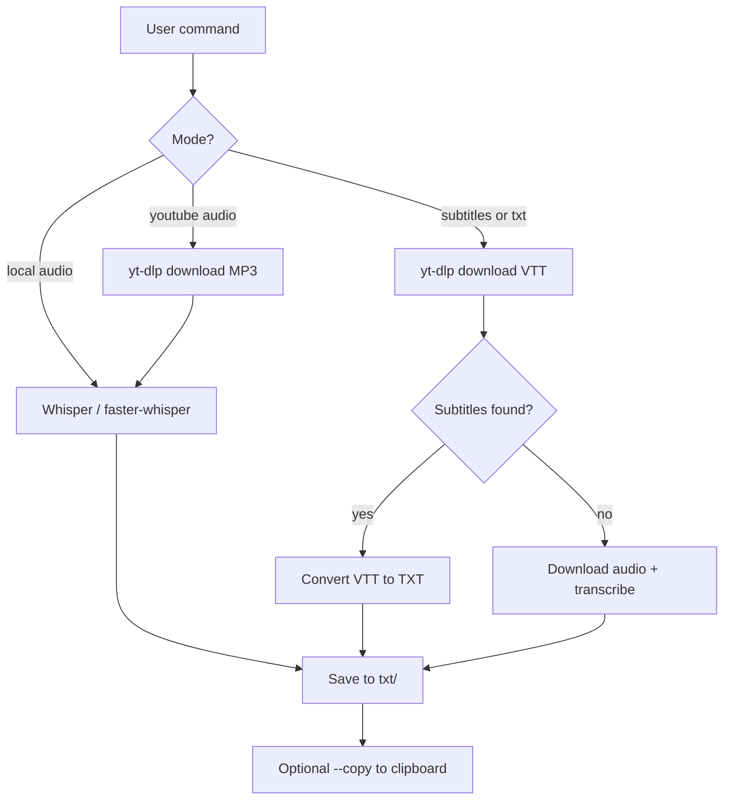

# Whisper Audio Transcriber

A command-line tool for transcribing audio with OpenAI Whisper, downloading YouTube subtitles, and falling back to automatic transcription when subtitles are unavailable. Optimized for Apple Silicon Macs.

**Entry point:** `./transcribe.sh` (activates the virtual environment and runs `transcribe.py`)

## What it does

- Transcribe local audio files (MP3, WAV, M4A, FLAC, and more)
- Download YouTube audio and transcribe it
- Download YouTube subtitles (fast) with automatic fallback to transcription when none exist
- Copy results to the clipboard, add benchmark headers, or include word-level timestamps

## Prerequisites

| Requirement | Notes |
|-------------|-------|
| **Python 3.11–3.13** | Tested with 3.11–3.13; Whisper ecosystem is most stable in this range |
| **ffmpeg** | Audio conversion and YouTube downloads |
| **yt-dlp** | YouTube subtitle and audio downloads |
| **Apple Silicon Mac** | Primary target; `faster-whisper` currently runs on CPU |

Install system tools on macOS:

```bash
brew install ffmpeg yt-dlp
```

## Installation

```bash
cd /path/to/transcribe

python3 -m venv venv
source venv/bin/activate
pip install -r requirements.txt

chmod +x transcribe.sh combine_txt.sh
```

### Global command (dotfiles)

To run `transcribe` from anywhere, symlink the launcher into your dotfiles bin (changes in this repo apply immediately):

```bash
ln -sf "$PWD/transcribe.sh" ~/.dotfiles/bin/bin/transcribe
ln -sf "$PWD/transcribe.sh" ~/bin/transcribe
```

`~/bin` is already on your PATH. The script resolves its own location, so outputs still land in this repo’s `txt/` and `audio/` folders no matter where you invoke it from.

## Quick start

```bash
# Transcribe a local file (shorthand — no --audio needed)
./transcribe.sh podcast.mp3

# YouTube subtitles (instant when available)
./transcribe.sh --subtitles "https://www.youtube.com/watch?v=VIDEO_ID"

# YouTube subtitles as TXT only (no .vtt kept)
./transcribe.sh --txt "https://www.youtube.com/watch?v=VIDEO_ID"

# Download YouTube audio and transcribe with Whisper
./transcribe.sh --youtube "https://www.youtube.com/watch?v=VIDEO_ID"

# Copy result to clipboard (works with --subtitles and --txt)
./transcribe.sh --subtitles "https://www.youtube.com/watch?v=VIDEO_ID" --copy

# Multiple YouTube URLs at once
./transcribe.sh --subtitles "URL1" "URL2" "URL3"

# Faster transcription with faster-whisper
./transcribe.sh podcast.mp3 --implementation faster --model medium
```

## Workflows



### Mode summary

| Mode | Command | Speed | Quality |
|------|---------|-------|---------|
| YouTube subtitles | `--subtitles` / `--txt` | Instant (when available) | Uses creator captions |
| YouTube transcribe | `--youtube` | Slower | Full Whisper pass |
| Local file | `./transcribe.sh file.mp3` | Depends on model | Full Whisper pass |
| Subtitle fallback | Automatic when `--subtitles` finds none | Fast (`base` + `faster`) | Good for speech-heavy videos |

When `--subtitles` or `--txt` is used and the video has no captions, the tool automatically downloads the audio and transcribes it. By default this uses `faster-whisper` with the `base` model; override with `--fallback-model` and `--implementation`.

## CLI reference

Run `./transcribe.sh --help` for the full list. Modes are **mutually exclusive** — do not combine `--audio` or `--youtube` with `--subtitles` or `--txt`.

| Flag | Description |
|------|-------------|
| `--audio PATH` | Path to a local audio file. Shorthand: `./transcribe.sh file.mp3` |
| `--youtube URL` | Download YouTube audio (MP3) and transcribe it |
| `--subtitles URL [URL ...]` | Download subtitles; keeps `.vtt` and `.txt`; falls back to transcription if none |
| `--txt URL [URL ...]` | Same as `--subtitles` but deletes the `.vtt` after conversion |
| `--subtitles-dir DIR` | Output directory for subtitle/transcription files (default: `txt/`) |
| `--copy` | Copy subtitle or transcription text to clipboard (only with `--subtitles` or `--txt`) |
| `--model SIZE` | Whisper model (default: `large-v3`). Choices: `tiny`, `base`, `small`, `medium`, `large`, `large-v2`, `large-v3` |
| `--fallback-model SIZE` | Model used when subtitle download fails and transcription runs instead (default: `base`) |
| `--implementation IMPL` | `whisper` (default) or `faster` (2–4× faster on CPU) |
| `--language CODE` | Target language ISO code (default: `en`) |
| `--output PATH` | Custom output file path for local/`--youtube` transcription |
| `--cleanup` | Delete source and converted audio files after successful transcription |
| `--benchmark` | Add a metadata header to the output `.txt` file |
| `--with-word-timestamps` | Prefix each word with `[HH:MM:SS.mmm]` |
| `--compare-models` | Print model comparison table and exit |

### Examples

```bash
# Local file with custom model and output
./transcribe.sh recording.wav --model medium --output my_transcript.txt

# YouTube full transcribe, then delete the downloaded MP3
./transcribe.sh --youtube "https://youtube.com/watch?v=VIDEO_ID" --cleanup

# Subtitle fallback with a higher-quality model
./transcribe.sh --subtitles "URL" --fallback-model small

# Word timestamps with faster-whisper
./transcribe.sh lecture.mp3 --implementation faster --with-word-timestamps

# Benchmark header in output file
./transcribe.sh podcast.mp3 --benchmark --implementation faster

# Compare models
./transcribe.sh --compare-models
```

## Output and file naming

### Default locations

- Local audio and `--youtube` transcriptions: `txt/<sanitized-name>.txt`
- YouTube subtitles: `txt/<title>-[<videoId>].en.vtt` and `.txt`
- Custom path: use `--output` or `--subtitles-dir`

### Local audio sanitization

Before transcription, local audio files are renamed to lowercase with hyphens (spaces and underscores become hyphens; special characters and emojis are removed). Example: `My Podcast (Ep 1).mp3` → `my-podcast-ep-1.mp3`.

YouTube subtitle filenames keep the original video title plus the video ID in brackets to avoid cache collisions between downloads.

### Benchmark header

With `--benchmark`, the output file starts with metadata:

```
# ============================================================
# TRANSCRIPTION BENCHMARK DATA
# ============================================================
# Generated: 2024-01-15 14:30:45
# Implementation: faster-whisper
# Model: large-v3
# Audio Duration: 5m 23s
# Processing Time: 2m 5s
# Speed: 2.58x real-time
# Detected Language: en
# ============================================================

[Your transcription text here...]
```

### Word timestamps

With `--with-word-timestamps`, each word is prefixed with its start time:

```
[00:00:01.234] Hello [00:00:01.456] world [00:00:01.678] this [00:00:01.890] is [00:00:02.012] a [00:00:02.134] test
```

Useful for subtitles, search, and pinpointing moments in long recordings.

## Implementations

| Implementation | Package | Best for |
|----------------|---------|----------|
| `whisper` (default) | openai-whisper | Verbose progress, full feature set |
| `faster` | faster-whisper | Speed and lower memory on CPU |

```bash
# Default OpenAI Whisper
./transcribe.sh audio.mp3

# faster-whisper (typically 2–4× faster)
./transcribe.sh audio.mp3 --implementation faster
```

## Models

| Model | Speed | Accuracy | RAM | Best for |
|-------|-------|----------|-----|----------|
| `tiny` | Very fast | Basic (~15–25% WER) | ~1 GB | Quick tests |
| `base` | Fast | Fair (~10–15% WER) | ~1 GB | Subtitle fallback, general use |
| `small` | Medium | Good (~8–12% WER) | ~2 GB | Balanced quality/speed |
| `medium` | Slow | Very good (~5–8% WER) | ~5 GB | Noisy audio, accents |
| `large-v3` | Very slow | Best (~2–4% WER) | ~10 GB | Maximum accuracy (default) |

Approximate real-time speed on M1 MacBook Pro (openai-whisper, CPU):

| Model | Speed |
|-------|-------|
| `tiny` | ~10–20× |
| `base` | ~8–15× |
| `small` | ~5–10× |
| `medium` | ~2–4× |
| `large-v3` | ~0.5–1× |

**Recommendations:**

- **Testing:** `tiny` or `base`
- **Everyday use:** `small` or `medium`
- **Best accuracy:** `large-v3` (default for `--audio` / `--youtube`)
- **Subtitle fallback:** `base` with `faster` (override with `--fallback-model`)

## Utilities

### combine_txt.sh

Merges all `.txt` files in a directory into a single `master.txt` with markdown-style headers. Useful for topic collections (e.g. `txt/coffee/`).

```bash
# Combine all txt files in the current directory
./combine_txt.sh

# Combine files in a specific directory
./combine_txt.sh txt/coffee/
```

Each source file becomes a `## filename` section in `master.txt`. The script skips any existing `master.txt` in the target directory.

### Completion sound

On successful transcription, the tool plays an audio file from `utils/effects/` if one exists whose name starts with `[use]`. Place any `.mp3`, `.wav`, or similar file there to customize it.

## Troubleshooting

### Missing packages

```bash
source venv/bin/activate
pip install -r requirements.txt
pip install faster-whisper   # if --implementation faster fails
```

### yt-dlp or ffmpeg not found

```bash
brew install ffmpeg yt-dlp
```

### `Failed to load audio` / `libmbedcrypto.16.dylib` not found

Homebrew dependency mismatch — `ffmpeg` (via `librist`) was built against an older `mbedtls` than what is installed. Rebuild the affected packages:

```bash
brew reinstall librist ffmpeg
```

Verify with `ffmpeg -version`, then retry transcription.

### Out of memory

Use a smaller model:

```bash
./transcribe.sh audio.mp3 --model medium
# or
./transcribe.sh audio.mp3 --model small --implementation faster
```

### Slow transcription

Try faster-whisper:

```bash
./transcribe.sh audio.mp3 --implementation faster --model medium
```

### Wrong or stale YouTube subtitles

Subtitle files include the video ID in the filename (e.g. `Title-[dQw4w9WgXcQ].en.txt`). The downloader tracks files before and after each run and disables yt-dlp caching to avoid returning an old file from a different video.

### Unsupported audio format

Convert with ffmpeg:

```bash
ffmpeg -i input.m4a output.mp3
```

### PyTorch issues on Apple Silicon

```bash
pip install torch torchaudio --index-url https://download.pytorch.org/whl/cpu
```

## Tips for best results

1. Use clear audio with minimal background noise
2. For YouTube, prefer `--subtitles` when captions exist — it is instant and often more accurate than Whisper on clean speech
3. Use `--implementation faster` for long files or batch work
4. Use `large-v3` when accuracy matters more than speed

## License

This tool uses OpenAI's Whisper model. Refer to [OpenAI's licensing terms](https://github.com/openai/whisper) for commercial use.
